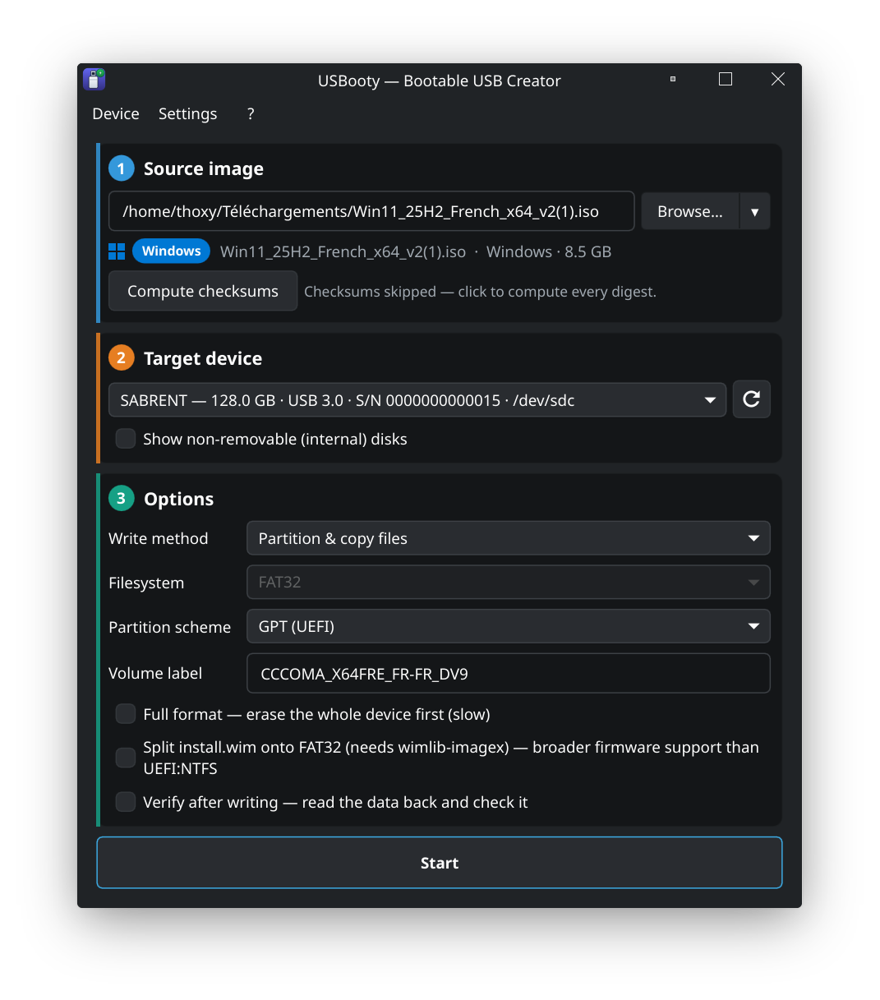

# usbooty

<p align="center">
  
</p>

<p align="center">Create bootable USB drives from ISO images on Linux. Rust with a Qt 6 / QML front end, and the bootable-media logic ported from <a href="https://github.com/pbatard/rufus">Rufus</a>.</p>

## What it does

* Raw DD, partitioned copy (FAT32 / NTFS / exFAT / ext4 / and more),
  plain format, Ventoy multi-boot, and FreeDOS builds.
* Windows install media with the UEFI:NTFS dual-partition layout (or a
  wimlib split) for ISOs whose `install.wim` is larger than the FAT32
  4 GiB file limit.
* Windows 11 setup customisation via `autounattend.xml`: hardware-check
  bypass, local account, locale, time zone, BitLocker auto-encryption
  guard, a debloat profile, and post-install desktop helper scripts.
* Direct Windows 10 / 11 ISO download from Microsoft (a port of Rufus's
  Fido).
* Persistent live USBs for the Ubuntu/casper, Debian-live (incl. Kali),
  Fedora, RHEL-rebuild, openSUSE, Arch/archiso (incl. Manjaro), Knoppix,
  Slax, and Alpine families.
* A QEMU boot test (BIOS, UEFI, UEFI + Secure Boot, virtual TPM 2.0) to
  verify the stick boots without rebooting your machine.
* Device health tooling: fake-capacity quick check, full bad-blocks
  scan, SMART warnings, read-back verify, and drive snapshot backups.
* Transparent decompression of `.xz` / `.gz` / `.bz2` / `.zst` /
  `.lzma` / `.zip` / `.Z` inputs and fixed `.vhd` images.

## Quick install

From the AUR (Arch and derivatives):

```sh
git clone https://git.thoxy.xyz/AUR/usbooty-git.git
cd usbooty-git
makepkg -fsi
```

From source:

```sh
cargo build --release
sudo ./install.sh
```

## Documentation

See [`docs/`](docs/) for the full picture. Start with
[`docs/index.md`](docs/index.md) for the table of contents.

## License

GPL-3.0-or-later.
